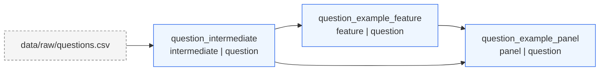

<!-- Auto-generated by scripts/update_dependency_docs.py. Do not edit by hand. -->
# Pipeline Dependency Map

This map is generated from the structured headers in `panel_factory/src/**/build_*.py`.
Update a builder header first, then run `python3 scripts/update_dependency_docs.py write`.

## Summary

- Artifacts: 3
- Intermediates: 1
- Features: 1
- Panels: 1
- External inputs: 1

## Dependency graph

## Artifact table

| artifact_key | kind | grain | merge_keys | inputs | downstream | output | built_by |
| --- | --- | --- | --- | --- | --- | --- | --- |
| `question_intermediate` | `intermediate` | `question` | `question_id` | `data/raw/questions.csv` | `question_example_feature`, `question_example_panel` | `data/features/question_intermediate.csv` | `panel_factory/src/panels/build_example_intermediate.py` |
| `question_example_feature` | `feature` | `question` | `question_id` | `question_intermediate` | `question_example_panel` | `data/features/question_example_feature.csv` | `panel_factory/src/features/build_example_feature.py` |
| `question_example_panel` | `panel` | `question` | `question_id` | `question_intermediate`, `question_example_feature` | none | `data/panels/question_example_panel.csv` | `panel_factory/src/panels/build_example_panel.py` |

## Artifact contracts

### `question_intermediate`

- Kind: `intermediate`
- Grain: `question`
- Merge keys: `question_id`
- Inputs: `data/raw/questions.csv`
- Output: `data/features/question_intermediate.csv`
- Builder: `panel_factory/src/panels/build_example_intermediate.py`
- Output columns:
  - Index: `question_id`
  - Core: `source_value`
  - Derived: none
- Logic:
  - Read the raw question source without modifying it.
  - Produce a minimal reusable question-level base table.

### `question_example_feature`

- Kind: `feature`
- Grain: `question`
- Merge keys: `question_id`
- Inputs: `question_intermediate`
- Output: `data/features/question_example_feature.csv`
- Builder: `panel_factory/src/features/build_example_feature.py`
- Output columns:
  - Index: `question_id`
  - Core: none
  - Derived: `example_feature`
- Logic:
  - Read the reusable question-level intermediate.
  - Build one example question-level feature without mutating the intermediate.

### `question_example_panel`

- Kind: `panel`
- Grain: `question`
- Merge keys: `question_id`
- Inputs: `question_intermediate`, `question_example_feature`
- Output: `data/panels/question_example_panel.csv`
- Builder: `panel_factory/src/panels/build_example_panel.py`
- Output columns:
  - Index: `question_id`
  - Core: `source_value`
  - Derived: `example_feature`
- Logic:
  - Read the reusable question-level intermediate and compact feature.
  - Late merge on question_id without rebuilding either upstream artifact.

## External inputs

- `data/raw/questions.csv`
